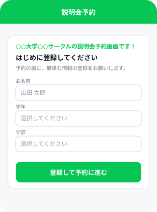
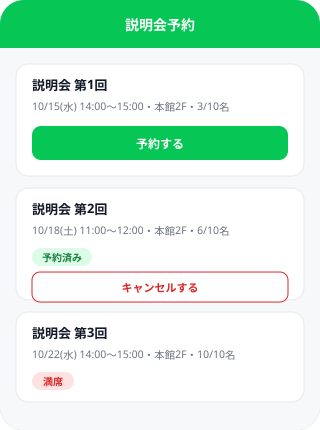
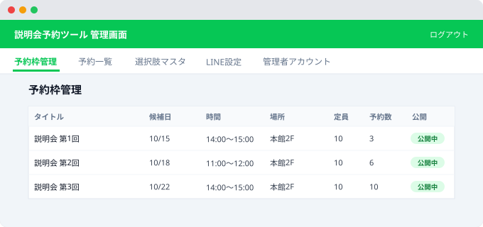

# 説明会予約ツール

LINE公式アカウント（LIFF）を使った、説明会・体験会などの候補日予約ミニアプリです。参加者はLINEから名前・学年・学部などを登録したうえで候補日を選んで予約し、予約確定時と前日にLINEで自動メッセージが届きます。PHP + MySQLのみで動作し、フレームワーク非依存です。

## できること

- **管理画面ログイン**：ID・パスワード（任意でLINEログインも可）。画面から管理者アカウントを複数作成・編集可能
- **予約枠管理**：候補日・時間・場所・定員を管理画面から登録
- **参加者登録＋予約（LIFF）**：初回アクセス時に名前・学年・学部を登録 → 候補日一覧から予約。学年・学部の選択肢は管理画面から編集可能。登録画面の冒頭には、管理画面で設定したサークル名を使って「〇〇大学〇〇サークルの説明会予約画面です！」と表示されます
- **LINEメッセージ配信**：予約確定時に本人へ確認メッセージを自動送信。前日には自動リマインダー（cron）、管理画面から個別に手動送信も可能
- **LINE設定画面**：Messaging APIのChannel ID / Secret / アクセストークン、LIFF IDを管理画面から設定

## 画面イメージ

| 参加者登録（LIFF） | 予約枠一覧（LIFF） |
|---|---|
|  |  |

**管理画面 — 予約枠管理**



## 技術構成

- PHP 8.x（フレームワーク非依存、素のPDO）
- MySQL / MariaDB
- LINE Messaging API + LIFF
- フロントは素のHTML/CSS/JavaScript（ビルド不要）

## セットアップ

詳しい手順は [`setup/README.md`](setup/README.md) を参照してください。おおまかな流れ：

1. MySQL/MariaDBのDBを1つ作成
2. `setup/.env.example` を `.env` にコピーしてDB接続情報を入力、ドキュメントルート外に配置
3. `setup/install.php` の `INSTALL_SECRET` を変更してアクセスし、テーブルを作成
4. `setup/create_admin.php` で最初の管理者アカウントを作成
5. 管理画面にログインし、「LINE設定」タブでLINE Messaging API / LIFFの情報を入力
6. 「予約枠管理」タブで候補日を登録すれば、LIFF予約ページ（`liff/reserve.php`）から予約を受け付けられます

## ディレクトリ構成

```
admin/      管理画面（ログイン・各種タブ）
api/        バックエンドAPI
common/     共通処理（DB接続・認証・LINE API・予約ロジック）
liff/       LIFF予約ページ
tools/      cron用スクリプト（前日リマインダー）
setup/      セットアップ手順・スキーマ・サンプル設定
```

## ライセンス

このリポジトリは学習・自由改変を想定した公開サンプルです。ライセンスを明示したい場合はLICENSEファイルを追加してください。
